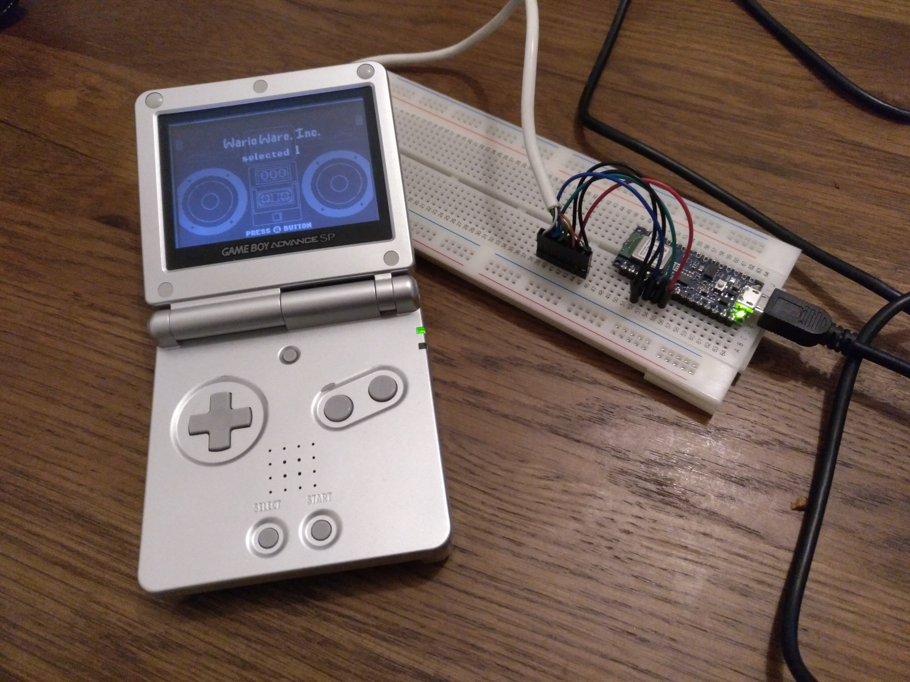
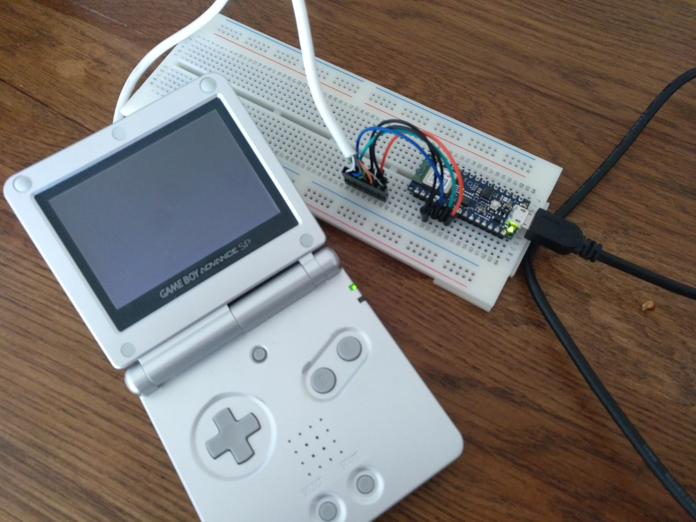
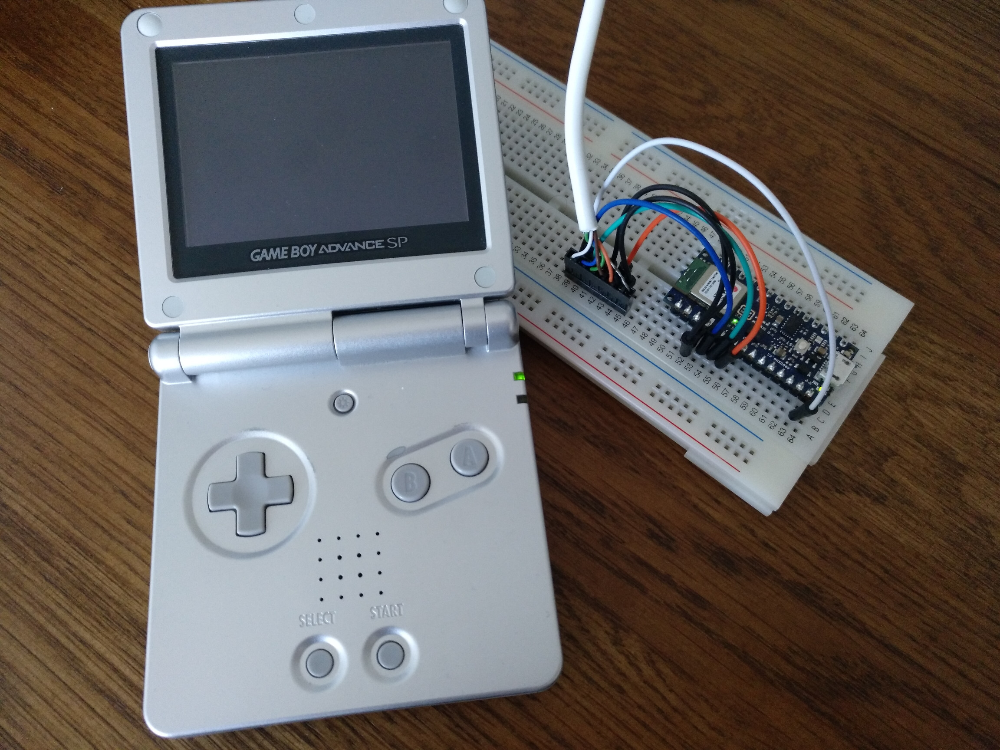

# GameBoy Advance multiboot

This repository contains a set of experiments relying on the GBA multiboot capabilities.

When powered without any cartridge (or with a cartridge, pressing Start and Select), the BIOS will wait for a link cable transmission.
A piece of bytecode can be transmitted from another device; this is typically used to allow multiplayer sessions with a single cartridge (e.g. Mario Kart) or give a limited demo version of the game.
As the game resides in RAM, this is limited to 256Ko.


## Upload multiboot through USB

_See [`serial`](./serial/)._

In this experiment, an Arduino (Nano BLE 33, in this case) is used as a bridge between the computer and the GBA.
A multiboot-compatible ROM is transmitted over USB; once successfully sent, the cable can be disconnected.

Regardless of the device used to communicate, make sure to use 3.3V!


### Link cable

The Link cable, in Normal mode, is a typical [Serial Peripheral Interface (SPI)](https://en.wikipedia.org/wiki/Serial_Peripheral_Interface), at 9600 bauds, 8-bits, no parity bit, one stop bit.
Wire colors are not universal, and may differ from other cables.
Its male connector (when looking at the connector) has the following pins:

```
        ___
   ____|   |____
  /             \
 /  1    3    5  \
 |               |
 |  2    4    6  |
 |_______________| 7
```

 1. VCC, 3.3V, white
 2. SO, serial out, blue
 3. SI, serial in, green
 4. SD, serial data, brown
 5. SC, serial clock, orange
 6. GND, ground, black
 7. Shield, seems to be connected on master GND

Connection is made in Normal mode (i.e. 32 bits), pins are connected as following:

 1. VCC, not connected (Arduino is powered over USB)
 2. SO - MISO
 3. SI - MOSI
 4. SD, not used in Normal mode, can be grounded
 5. SC - SCLK
 6. GND - GND

The [`passthrough.ino`](./serial/passthrough/passthrough.ino) sketch will exchange 32-bits payloads over USB with the GBA.


### Multiboot protocol

When powered up without any cartridge, the slave GBA will wait for instruction from the Link cable, from another device, the master GBA.
There are two modes, Normal and MultiPlay, depending on how many devices need to be connected; for a two devices scenario, the Normal mode can is faster.
The slave will automatically detect which mode is used by the master.

The protocol is implemented in [`upload.py`](./serial/upload.py), which can be used to upload a ROM file.
See [this documentation](https://www.problemkaputt.de/gbatek.htm#biosmultibootsinglegamepak) for more details.

```
python upload.py rom.mb COM3
```

Multiboot ROMs can be found on the web, usually featuring the `.mb` extension.
A few examples:

 * [Vitamins](https://pineight.com/gba/#drm), an homebrew game by Damian Yerrick;
 * ...




### Compile multiboot ROM

The GameBoy Advance features an ARM-based processor.
We will use [devkitPro](https://devkitpro.org/wiki/Main_Page) to compile binaries.

The most straightforward approach is to use the [Docker image](https://github.com/devkitPro/docker).
We share the local folder with the container, to avoid unnecessary copies.

```
# Run in interactive mode
docker run -ti -v ${PWD}:/rom devkitpro/devkitarm
# On Windows: docker run -ti -v %cd%:/rom devkitpro/devkitarm

# Add compiler binaries to path
export PATH="/opt/devkitpro/devkitARM/bin/:$PATH"

# Go to shared folder and build files
cd /rom/
make
```

For convenience, [`rom.mb`](./serial/rom.mb) is already compiled, and feature a minimalistic demo, where a white pixel is moved across the screen.




## Upload multiboot from embedded device

_See [`embedded`](./embedded/)._

In this experiment, the Arduino is only connected to the GBA (i.e. it uses VCC from the Link cable).
The multiboot ROM is stored in the flash memory, with the upload code.

The ROM can be converted into a C file using:

```
python convert.py ../serial/rom.mb loader/rom.h
```




## References

GameBoy Advance resources:

 * https://www.gbadev.org/
 * https://www.akkit.org/info/gbatek.htm
 * http://www.akkit.org/info/gba_comms.html
 * http://www.hardwarebook.info/Game_Boy_Link
 * http://www.devrs.com/gba/files/gbadevfaqs.php

GBA resources, related to multiboot:

 * https://www.problemkaputt.de/gbatek.htm#biosmultibootsinglegamepak
 * https://retrocomputing.stackexchange.com/questions/14317/what-is-the-protocol-for-bootstrapping-a-game-boy-advance-over-a-link-cable
 * https://www.youtube.com/watch?v=fJGjm9tzZyI

A few of the many implementations of multiboot upload found on the web:

 * https://github.com/akkera102/gba_03_multiboot
 * https://github.com/ataulien/elm-gba-multiboot
 * https://github.com/athreef/Device-GBA
 * https://github.com/bartjakobs/GBA-Multiboot-Python
 * https://github.com/cartr/MSMCcable
 * https://github.com/ConnorRigby/gba-multi-boot-cable
 * https://github.com/MerryMage/gba-multiboot
 * https://github.com/rodri042/gba-remote-play
 * https://github.com/Shyri/gba-bt-hid
 * https://github.com/stuij/gba-serial-adventures
 * https://github.com/tangrs/usb-gba-multiboot

Regarding GBA development:

 * https://github.com/devkitPro/docker
